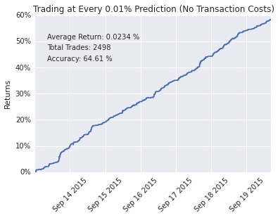
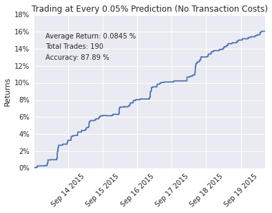
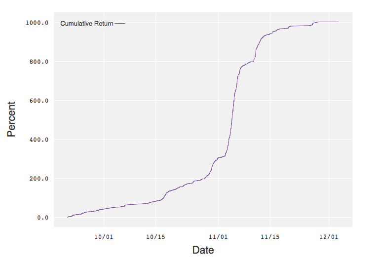

# bitpredict

## Summary
This project aims to make high frequency bitcoin price predictions from market microstructure data. The dataset is a series of one second snapshots of open buy and sell orders on the Bitfinex exchange, combined with a record of executed transactions. Data collection began 08/20/2015.

A number of engineered features are used to train a Gradient Boosting model, and a theoretical trading strategy is simulated on historical and live data.

## Target
The target for prediction is the midpoint price 30 seconds in the future. The midpoint price is the average of the best bid price and the best ask price.

## Features

#### Width
This is the difference between the best bid price and best ask price.

#### Power Imbalance
This is a measure of imbalance between buy and sell orders. For each order, a weight is calculated as the inverse distance to the current midpoint price, raised to a power. Total weighted sell order volume is then subtracted from total weighted buy order volume. Powers of 2, 4, and 8 are used to create three separate features. 

#### Power Adjusted Price
This is similar to Power Imbalance, but the weighted distance to the current midpoint price (not inverted) is used for a weighted average of prices. The percent change from the current midpoint price to the weighted average is then calculated. Powers of 2, 4, and 8 are used to create three separate features. 

#### Trade Count
This is the number of trades in the previous X seconds. Offsets of 30, 60, 120, and 180 are used to create four separate features.

#### Trade Average
This is the percent change from the current midpoint price to the average of trade prices in the previous X seconds. Offsets of 30, 60, 120, and 180 are used to create four separate features.

#### Aggressor
This is measure of whether buyers or sellers were more aggressive in the previous X seconds. A buy aggressor is calculated as a trade where the buy order was more recent than the sell order. A sell aggressor is the reverse. The total volume created by sell aggressors is subtracted from the total volume created by buy aggressors. Offsets of 30, 60, 120, and 180 are used to create four separate features.

#### Trend
This is the linear trend in trade prices over the previous X seconds. Offsets of 30, 60, 120, and 180 are used to create four separate features.

## Model
The above features are used to train a Gradient Boosting model. The model is validated using a shifting 100,000 second window where test data always occurs after training data. The length of training data accumulates with each successive iteration. Average out of sample R-squared is used as an evaluation metric. With four weeks of data, an out of sample R-squared of 0.0846 is achieved.

## Backtest Results
A theoretical trading strategy is implemented to visualize model performance. At any model prediction above a threshold, a simulated position is initiated and held for 30 seconds, with only one position allowed at a time. Theoretical execution is done at the midpoint price without transaction costs.

The results at different thresholds can be seen below. Three weeks of data are used for training, with one week of data used for theoretical trading.

## Live Results
The model was run on live data and theoretical results were displayed on a web app. Performance with a 0.01% trading threshold can be seen below.

